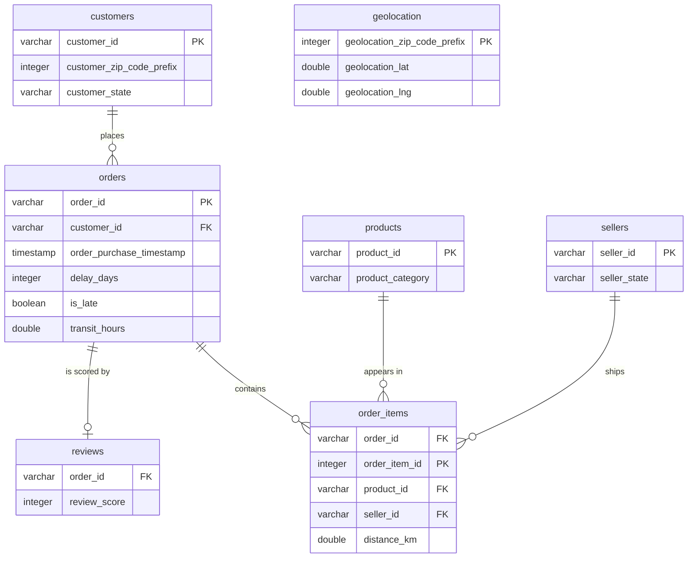

# Logistics Pulse

E-commerce delivery delay analysis - diagnosing where and why deliveries
run late, and what it costs the business. Built on the Olist Brazilian
E-Commerce dataset (2016-2018).

**Status:** cleaning, database and SQL analysis are complete. The Power BI
dashboard is in progress.

## Table of Contents

- [Business Problem](#business-problem)
- [Key Findings](#key-findings)
- [Recommendation](#recommendation)
- [Data & Methodology](#data--methodology)
- [Tech Stack](#tech-stack)
- [Repo Structure](#repo-structure)
- [How to Run](#how-to-run)
- [Limitations & Next Steps](#limitations--next-steps)
- [Data Source & License](#data-source--license)

## Business Problem

Olist is a Brazilian marketplace. Sellers list their products on it, Olist
promises each customer a delivery date, and a carrier takes the parcel the
rest of the way. When a parcel arrives after the promised date the customer
blames the marketplace, not the carrier, and says so in a review.

This project answers four questions in order: how often does that happen,
where does the delay come from, what does it cost, and what should be done
about it.

## Key Findings

- **6.77%** of delivered orders arrive after the promised date - 6 534 out of
  96 470.
- The time is lost **in transport**, not at the seller. A late order spends
  629 hours in transit against 167 for an on-time one, while seller
  preparation grows only from 43 to 74 hours.
- **No seller and no product category stands out.** Both sit flat around the
  6.8% baseline, so the problem is about where orders go, not who ships them.
- Distance raises the risk - from 4.5% under 100 km to 11.6% above 1 500 km -
  but it does not explain Rio de Janeiro. Compared with other states at the
  same distance and in the same months, Rio ran **26.2% against Sao Paulo's
  7.3%**.
- **The problem comes and goes.** Three months - November 2017, February and
  March 2018 - hold **48%** of all late orders.
- Rio was normal until October 2017, ran up to **5 times worse** than the rest
  of the country for six months, and returned to normal in April 2018. The
  episode produced **749 late deliveries** beyond what the rest of the
  country's rate would have caused: **11.5% of every late order in the data**.
- Delivery then got faster, from about **10 days to 7**, and the promised
  window did not lengthen - so the improvement is real, not a looser promise.
- A late delivery in Rio cost **2.39 review points**. Most of the damage is
  done within the first week: 58.6% of orders 4 to 7 days late get one star,
  against 6.6% of orders that arrive on time.

## Recommendation

**Track the late rate by state each month against the rest of the country, and
investigate any state that runs at twice that rate for two months running.**

Rio was at twice the rest of the country from November 2017 to March 2018, so
the rule would have fired at the end of December. **426 of its 749 excess late
deliveries - 57% - came after that**, worth about 1 020 review points.

The rule finds the next episode sooner. It cannot explain this one: the data
holds no carrier, no route and no delivery district.

## Data & Methodology

The raw dataset is nine CSV files covering roughly 100 000 orders placed
between September 2016 and August 2018.

**Cleaning** (`cleaning/`) is one script per source table, each a set of small
functions with their own tests. Orders get three stage durations calculated
from the five source timestamps - payment approval, seller preparation,
transport - plus a delay in days and an `is_late` flag. Geolocation is
aggregated to one coordinate per zip prefix and used to measure the
straight-line distance of every order item with the haversine formula.
Reviews are deduplicated to the latest review per order.

Three decisions shaped the numbers above:

- **Lateness compares dates, not timestamps.** The promised date carries no
  time of day, so comparing raw timestamps marks same-day deliveries as late
  and pushes the rate from 6.77% to 8.11%.
- **The payments table was measured and then dropped.** Boleto, a bank slip
  paid by hand, takes 29 hours to clear against 16 minutes for a card - but
  boleto orders are late 7.3% of the time against 6.7% for cards, about 120
  orders out of 6 534. The promised date absorbs the slower payment.
- **Product weight was measured and then dropped.** Heavier items do run late
  slightly more often, but category already covers most of it, and a category
  is something a logistics team can act on.

**Storage** is a DuckDB database built by `database/load_data.py` from
`sql/schema.sql`. The schema declares primary keys, foreign keys and check
constraints, so a load that would break the model fails instead of producing
quiet nonsense.



`order_items` has a composite primary key of order_id and order_item_id.
`geolocation` is deliberately not linked: 157 customer and 7 seller zip
prefixes have no coordinates, and a foreign key would reject those rows
instead of leaving the distance unknown.

**Analysis** (`notebooks/02_sql_analysis.ipynb`) answers eight business
questions in SQL, each narrowing the previous one. Every query also lives in
`sql/kpi_queries.sql`.

Two things are worth calling out about the method. The funnel changed while
the work was running: two questions originally aimed at sellers were
redirected once the data showed sellers were flat. And a conclusion that Rio
was permanently broken was withdrawn after the monthly view showed the problem
had a start and an end. Both changes are recorded in `NOTES.md`.

## Tech Stack

| Tool | Use |
|---|---|
| Python 3 / pandas | cleaning and reshaping |
| pyarrow | parquet storage between cleaning and database |
| DuckDB | analytical database, schema with keys and constraints |
| SQL | the analysis itself |
| pytest | unit tests for every cleaning function |
| JupyterLab | the analysis notebooks |
| Power BI | dashboard (in progress) |

## Repo Structure

```
logistics-pulse/
├── cleaning/
│   ├── clean_orders.py           # delay, stage durations, is_late flag
│   ├── clean_order_items.py      # shipping deadline flag
│   ├── clean_products.py         # category names translated to English
│   ├── clean_reviews.py          # one review per order
│   └── clean_geography.py        # coordinates, customers, sellers, distances
├── tests/                        # one test file per cleaning script
├── sql/
│   ├── schema.sql                # tables, keys and constraints
│   └── kpi_queries.sql           # every query from the analysis
├── database/
│   └── load_data.py              # builds the DuckDB database from parquet
├── notebooks/
│   ├── 01_exploration.ipynb      # first look at the raw data
│   └── 02_sql_analysis.ipynb     # the eight business questions
├── analysis/                     # exports for the dashboard (in progress)
├── powerbi/                      # dashboard file (in progress)
├── data/
│   ├── raw/                      # Olist CSV files, not in version control
│   ├── processed/                # cleaned parquet files
│   └── warehouse/                # the DuckDB database
├── conftest.py                   # pytest configuration
├── requirements.txt
└── NOTES.md                      # decisions taken while building, and why
```

## How to Run

```bash
python -m venv .venv
source .venv/bin/activate        # Windows: .venv\Scripts\activate
pip install -r requirements.txt
```

Download the dataset from Kaggle and unzip the CSV files into `data/raw/`.

The scripts use relative paths, so each one runs from its own folder. The
order matters in one chain: `clean_order_items.py` reads the cleaned orders,
and `clean_geography.py` reads both, so it goes last. Products and reviews are
independent of the rest.

```bash
cd cleaning
python clean_orders.py
python clean_order_items.py
python clean_products.py
python clean_reviews.py
python clean_geography.py
```

Then build the database:

```bash
cd ../database
python load_data.py
```

The tests run from the repo root:

```bash
pytest
```

Open `notebooks/02_sql_analysis.ipynb` to read the analysis.

## Limitations & Next Steps

- The 6.77% covers delivered orders only. A further 2 965 orders never arrived
  at all, so "93% on time" does not mean "93% of orders arrived".
- The data holds no carrier, no route and no delivery district, so it shows
  where and when deliveries failed, but not why.
- Distance is a straight line between zip code centres, not a road distance,
  so anything under a few tens of kilometres is noise rather than signal.
- Distance and region cannot be separated. States that are far away are also
  served differently, so the distance gradient is a pattern rather than a
  proven cause.
- The Rio episode covers Black Friday and Christmas, so part of the rise is
  seasonal demand.
- Review scores stand in for cost. There is no money in this dataset, so a
  late delivery can only be priced in review points.
- Outside sources point to one hypothesis worth testing: cargo theft in Rio
  state peaked in 2017 at a record 10 599 incidents, and a federal security
  intervention was decreed on 16 February 2018 with cargo theft among its
  targets. The period, the state and the stage all match the episode in this
  data - but matching timing is not proof.
- Next: a Power BI dashboard that puts the detection rule above in front of
  someone who can act on it.

## Data Source & License

Data from the [Olist Brazilian E-Commerce dataset](https://www.kaggle.com/datasets/olistbr/brazilian-ecommerce)
on Kaggle, licensed under CC BY-NC-SA 4.0. Used here for educational and
portfolio purposes only.
